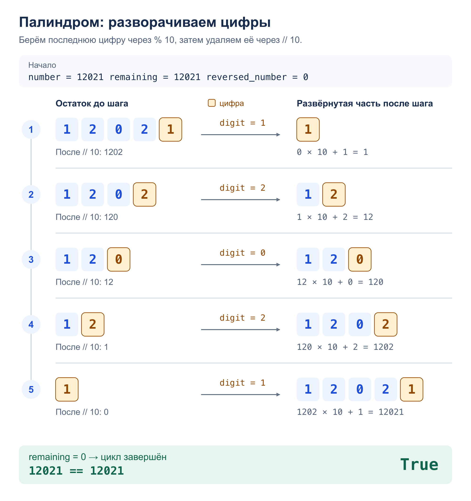

# Задача 1. Палиндром

Проверить, является ли положительное целое число палиндромом, без строк.

[Решение](solution.py) · [Тесты](test_solution.py)

## Алгоритм

`is_palindrome(number)` разворачивает число с помощью арифметики:
`remaining % 10` извлекает последнюю цифру, а `remaining //= 10` удаляет её.
Цифру добавляем справа к результату: `reversed_number * 10 + digit`.

После обработки всех цифр получаем число в обратном порядке.
Если оно равно исходному, это палиндром. Для `0` ответ — `True`,
для отрицательных чисел — `False`.

## Сложность

- Время: `O(d)`, где `d` — число цифр. Каждую цифру обрабатываем один раз.
- Память: `O(1)` — постоянное число целочисленных переменных.

## Пример: `12021`



## Запуск и тесты

Из корня репозитория; на вход — одно целое число:

```bash
python3 homework_1/palindrome/solution.py
python3 -m unittest homework_1.palindrome.test_solution -v
```

Тесты проверяют примеры из условия, однозначные числа, палиндромы разной длины,
нули внутри и на конце, непалиндромы, отрицательные и большие числа, ввод и вывод.
