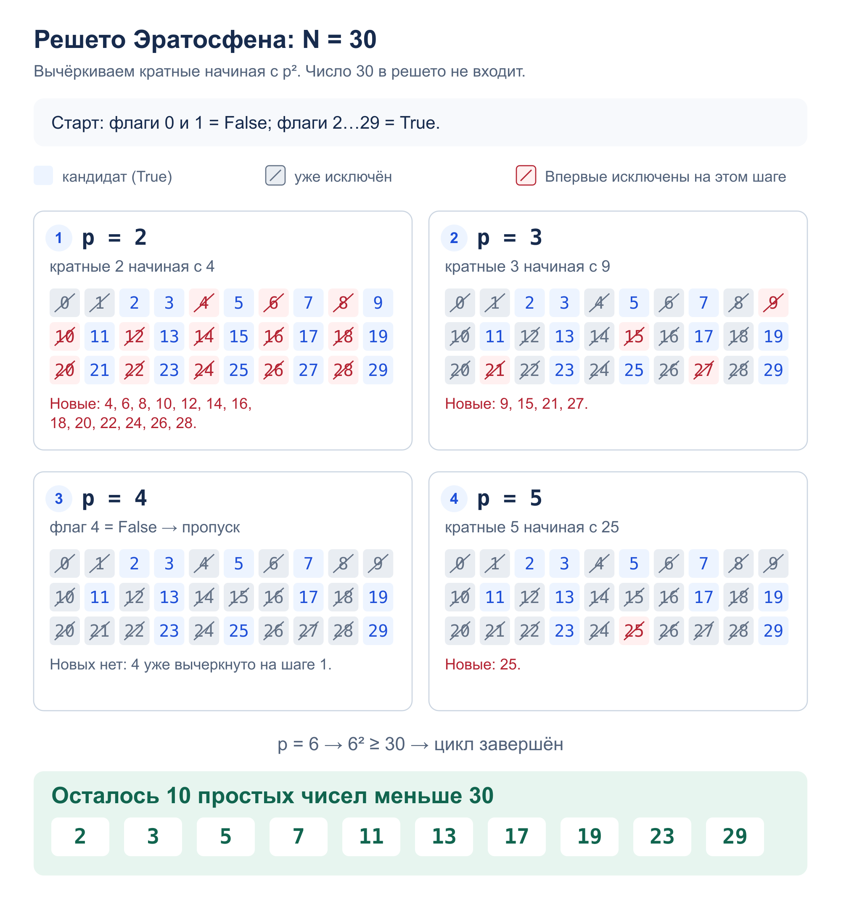

# Задача 3. Простые числа

Посчитать простые числа строго меньше `N`.

[Решение](solution.py) · [Тесты](test_solution.py)

## Алгоритм

`count_primes(n)` использует решето Эратосфена. В списке `is_prime` храним
флаги для чисел от `0` до `n - 1`; `0` и `1` сразу исключаем.
Для каждого простого `p`, пока `p * p < n`, вычёркиваем его кратные
начиная с `p * p`. Меньшие составные кратные уже вычеркнуты раньше.

Вычёркиваются только составные числа. У каждого составного `x` есть простой
делитель не больше `sqrt(x)`, поэтому все такие числа будут исключены.
Ответ — число оставшихся флагов `True`: `sum(is_prime)`.
При `n <= 2` сразу возвращаем `0`.

## Сложность

- Время: `O(n log log n)`. Для простого `p` отмечаем до `n / p` кратных;
  сумма `1 / p` по простым растёт как `O(log log n)`.
- Память: `O(n)` — список из `n` флагов.

## Пример: `N = 30`




## Запуск и тесты

Из корня репозитория; на вход — целое число `N`:

```bash
python3 homework_1/prime/solution.py
python3 -m unittest homework_1.prime.test_solution -v
```

Тесты проверяют примеры, `N <= 2`, строгую верхнюю границу, квадраты простых,
значения до 10 000, ввод и вывод. Для `N` от −5 до 200 ответ сравнивается
с результатом перебора делителей каждого числа.
