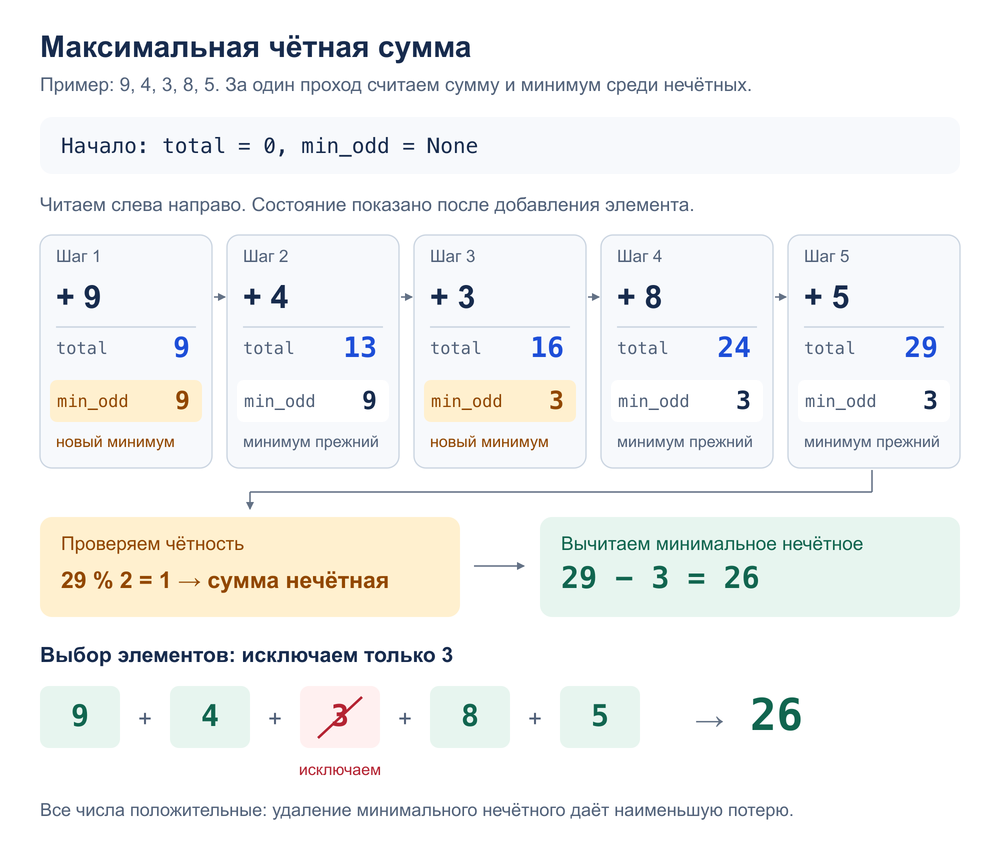

# Задача 2. Сумма

Найти максимальную чётную сумму выбранных элементов массива положительных чисел.
Элементы не обязаны идти подряд. Пустой набор даёт сумму `0`.

[Решение](solution.py) · [Тесты](test_solution.py)

## Алгоритм

`max_even_sum(numbers)` за один проход находит общую сумму `total`
и минимальное нечётное число `min_odd`.

Если `total` чётна, берём все элементы: из положительных чисел большую сумму
не получить. Иначе возвращаем `total - min_odd`.

Чтобы изменить чётность, нужно исключить набор с нечётной суммой.
В нём есть нечётное число, поэтому потеря не меньше `min_odd`.
Исключив только `min_odd`, получаем максимальную чётную сумму.

## Сложность

- Время: `O(k)`, где `k` — длина массива. Достаточно одного прохода.
- Память: `O(1)` — храним сумму, минимум и текущий элемент.

## Пример: `9 4 3 8 5`



[Схема в SVG](images/algorithm.svg)

## Запуск и тесты

Из корня репозитория; на вход — числа через пробел в одной строке:

```bash
python3 homework_1/sum/solution.py
python3 -m unittest homework_1.sum.test_solution -v
```

Тесты проверяют примеры, пустой массив, один элемент, повторы, чётные и нечётные
суммы, большие числа, ввод и вывод. Ещё для 341 небольшого массива ответ
сравнивается с результатом полного перебора вариантов выбора элементов.
