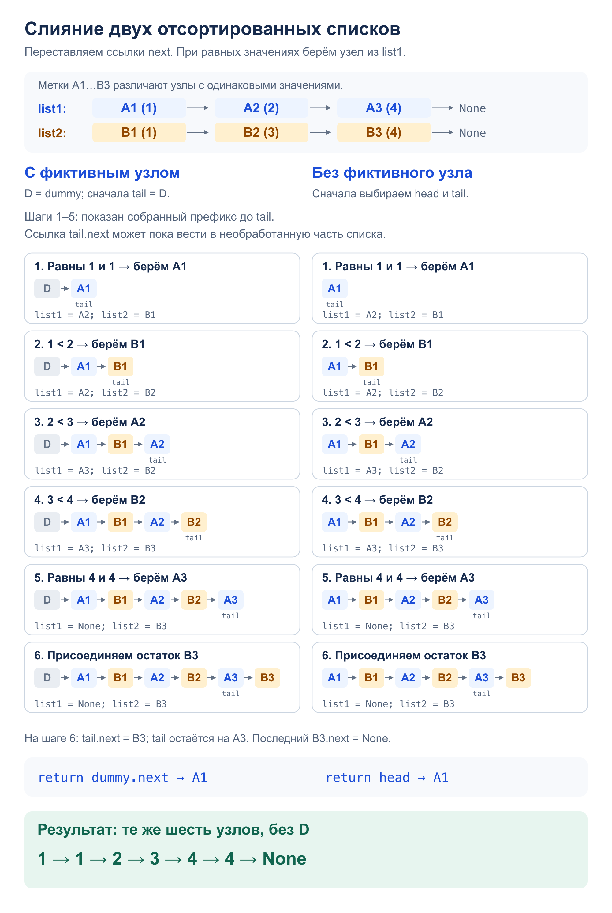

# Задача 3. Merge lists

Объединить два отсортированных односвязных списка и вернуть голову результата.
Результат состоит из исходных узлов: меняются ссылки `next`, значения не копируются.

[Решение](solution.py) · [Тесты](test_solution.py)

## Алгоритм

Сравниваем первые необработанные узлы и присоединяем меньший к `tail`.
При равенстве берём узел из `list1`. Выбранный узел — наименьший среди оставшихся,
поэтому порядок сохраняется. Когда один список заканчивается, присоединяем остаток другого.

- `merge_with_dummy` начинает с фиктивного узла `dummy` и возвращает `dummy.next`.
  Фиктивный узел не входит в результат.
- `merge_without_dummy` сначала выбирает `head` из двух первых узлов,
  затем выполняет тот же цикл. Если один вход пуст, сразу возвращает другой.

Оба способа меняют связи исходных списков. Для повторного слияния нужны заново
созданные списки. `build_list` и `to_list` служат для ввода, вывода и тестов.

## Сложность

- Время: `O(n + m)`, где `n` и `m` — длины списков. Каждый узел выбирается не более одного раза.
- Дополнительная память слияния: `O(1)` — несколько ссылок и, в первом способе, один фиктивный узел.
  Преобразования для ввода и вывода требуют `O(n + m)` памяти отдельно от слияния.

## Пример: `[1, 2, 4]` и `[1, 3, 4]`



## Запуск и тесты

Из корня репозитория; два списка через пробел, каждый в своей строке.
Пустая строка означает пустой список. Программа запускает вариант с фиктивным узлом.

```bash
python3 homework_2/merge_lists/solution.py
python3 -m unittest homework_2.merge_lists.test_solution -v
```

Оба способа проверяются на пустых списках, одном узле, повторах, отрицательных
и больших числах, разной длине и 10 000 узлов. Перебираются все 1225 пар списков
длины до 4 со значениями −1, 0, 1. Проверяются исходные узлы, неизменность значений,
отсутствие циклов и лишних новых узлов, ввод и вывод.
