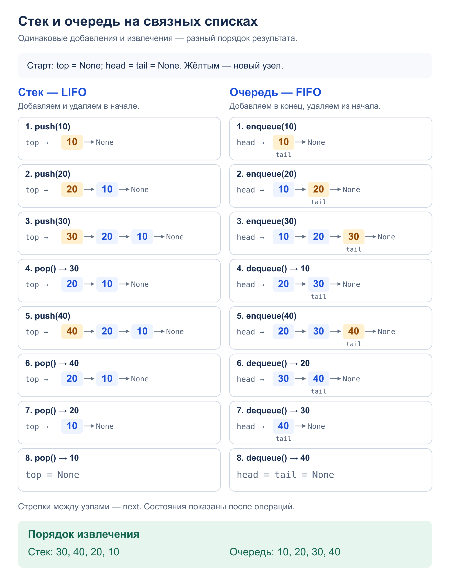

# Задача 1. Stack vs queue

Реализовать стек и очередь на односвязных списках без сторонних библиотек.

[Решение](solution.py) · [Тесты](test_solution.py)

## Алгоритм

Каждый узел хранит значение и ссылку `next` на следующий узел.

`Stack` добавляет (`push`) и удаляет (`pop`) узлы в начале списка — `_top`.
Последний добавленный узел становится вершиной и извлекается первым: LIFO.

`Queue` добавляет (`enqueue`) узлы после `_tail`, а удаляет (`dequeue`)
из начала — `_head`. Поэтому раньше добавленный узел извлекается раньше: FIFO.
При удалении последнего узла обе ссылки становятся `None`.

У обоих классов есть `peek()` без удаления, `is_empty()` и `len()`.
Извлечение и `peek()` для пустой структуры вызывают `IndexError`.

## Сложность

- Каждая операция: `O(1)` по времени — меняем несколько ссылок; размер храним отдельно.
- Память структуры: `O(n)` для `n` узлов. Одна операция требует `O(1)` дополнительной памяти.

## Пример: добавления и извлечения



## Запуск и тесты

Из корня репозитория; программа показывает порядок извлечения `10, 20, 30`:

```bash
python3 homework_2/stack_vs_queue/solution.py
python3 -m unittest homework_2.stack_vs_queue.test_solution -v
```

Тесты проверяют пустую структуру, один элемент, повторы, `peek`, размер,
повторное заполнение и независимость экземпляров. Также проверяются 10 000 узлов,
все 256 сочетаний восьми добавлений и извлечений, пример со схемы и вывод программы.
