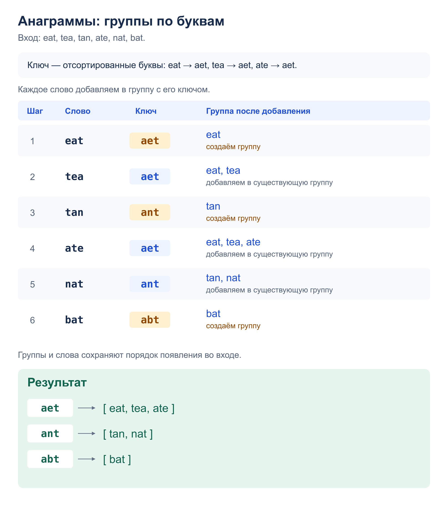

# Задача 2. Anagrams

Сгруппировать слова так, чтобы в одной группе оказались все анаграммы.

[Решение](solution.py) · [Тесты](test_solution.py)

## Алгоритм

`group_anagrams(words)` сортирует символы каждого слова и использует полученную
строку как ключ словаря. Например, `eat`, `tea` и `ate` дают ключ `aet`.
Слово добавляется в список своей группы.

Ключи совпадают ровно у слов с одинаковыми символами и числом их повторений,
поэтому каждая группа содержит все анаграммы своего слова.
Регистр учитывается, одинаковые слова сохраняются. Группы и слова возвращаются
в порядке появления во входе; порядок групп в примере условия другой,
но их состав совпадает.

## Сложность

- Время в среднем: `O(n + Σ lᵢ log(lᵢ + 1))`, где `lᵢ` — длина i-го слова.
  Проходим `n` слов и сортируем символы каждого.
- Память: `O(n + L)`, где `L` — сумма длин слов: ключи групп и списки ссылок на слова.

## Пример: `eat, tea, tan, ate, nat, bat`



## Запуск и тесты

Из корня репозитория; на вход — JSON-массив в одной строке,
например `["eat", "tea", "tan", "ate", "nat", "bat"]`. Вывод - JSON-массив групп:

```bash
python3 homework_3/anagrams/solution.py
python3 -m unittest homework_3.anagrams.test_solution -v
```

Тесты проверяют пример, пустой вход и пустые строки, повторы слов и букв,
разный регистр, кириллицу, другие символы, длинные слова и сохранность входа.
Для 585 небольших списков результат сравнивается с группировкой по числу букв.
