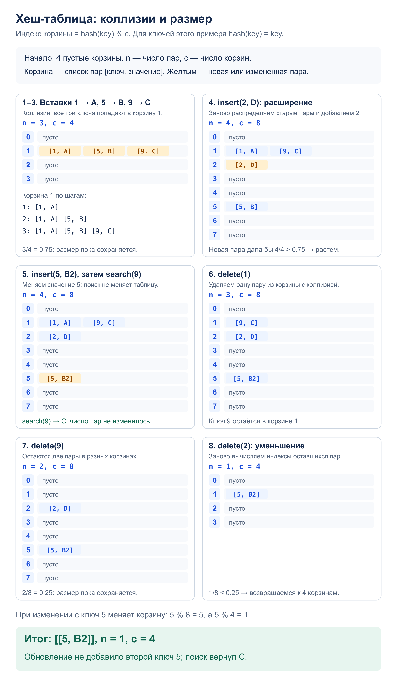

# Задача 3. Хеш-таблица

Хранить пары «ключ–значение», выполнять вставку, поиск и удаление по ключу.
Для хранения используются только списки.

[Решение](solution.py) · [Тесты](test_solution.py)

## Алгоритм

`HashTable` хранит список корзин. Каждая корзина — список пар `[ключ, значение]`.
Индекс корзины: `hash(key) % capacity`. Готовая хеш-таблица, `dict` и `set`
в реализации не используются; `hash` — встроенная функция Python.

Коллизии разрешаются списком пар в одной корзине. В ней сравниваем ключи:
`insert` заменяет значение существующего ключа или добавляет новую пару,
`search` возвращает значение, `delete` удаляет пару. Для отсутствующего ключа
поиск и удаление вызывают `KeyError`; значение `None` хранится как обычное значение.

Перед новой вставкой удваиваем число корзин, если заполнение превысит `0.75`.
После удаления уменьшаем его вдвое, пока заполнение ниже `0.25`, но не ниже
начального размера. При изменении размера заново вычисляем индексы всех пар.
Поэтому поиск продолжает находить их; разные пороги предотвращают частые
расширения и уменьшения при чередовании вставок и удалений.

Ключ может быть любым хешируемым объектом с неизменными хешем и правилами сравнения.
Есть `len(table)`, `key in table`, число корзин `capacity` и `items()` — список копий пар.

## Сложность

- Поиск: `O(1)` в среднем; вставка и удаление — `O(1)` в среднем по серии операций.
  При равномерном распределении ключей корзины короткие, перестроения редки.
- При коллизии всех ключей поиск, вставка и удаление требуют `O(n)`.
  Перестроение занимает `O(n + c)`, где `c` — число корзин.
- Память: `O(n + c)` для пар и корзин; `items()` создаёт ещё `O(n)` данных.

Оценки предполагают `O(1)` для вычисления хеша и сравнения ключей.

## Пример: коллизии, расширение и удаление



## Запуск и тесты

Из корня репозитория; программа выполняет пример со схемы:

```bash
python3 homework_3/hash_table/solution.py
python3 -m unittest homework_3.hash_table.test_solution -v
```

Тесты проверяют коллизии, замену значений, удаление из разных мест корзины,
пороги изменения размера, пустую таблицу, отсутствующие и нехешируемые ключи,
разные типы ключей, хранение только в списках и 10 000 элементов.
Ещё 3000 смешанных операций сравниваются со стандартным `dict` в тестах.
