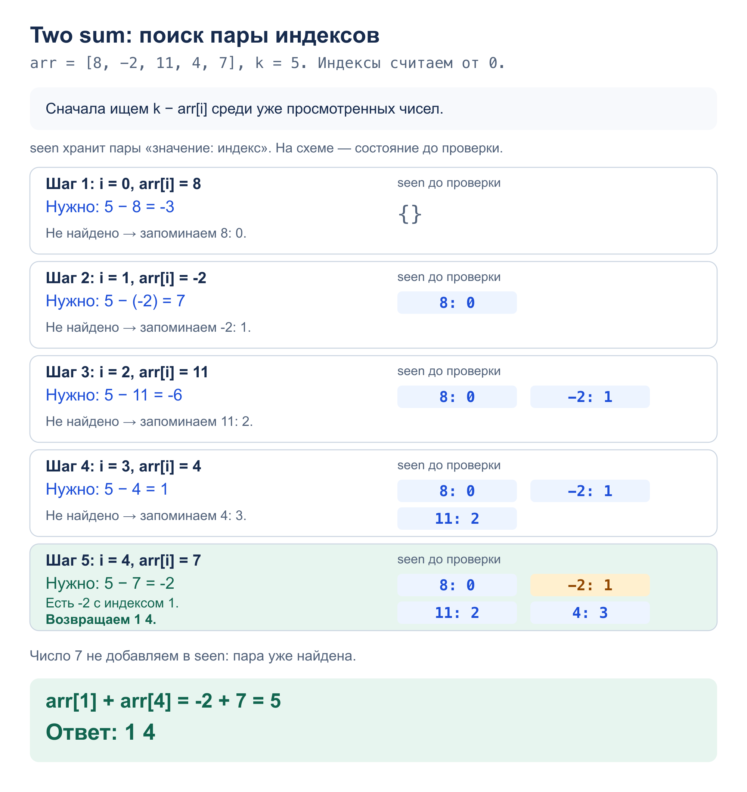

# Задача 1. Two sum

Найти два разных индекса элементов, сумма которых равна `k`.
По условию пара ровно одна. Индексы считаются от нуля и выводятся по возрастанию.

[Решение](solution.py) · [Тесты](test_solution.py)

## Алгоритм

`two_sum(arr, k)` проходит массив слева направо. Словарь `seen` хранит
значения уже просмотренных элементов и их индексы.

Для текущего числа ищем `k - number` в `seen`. Если оно есть, возвращаем
сохранённый индекс и текущий. Иначе записываем число в словарь.
Проверка идёт до записи, поэтому один элемент не используется дважды.
Сохранённый индекс всегда меньше текущего; к моменту второго элемента пары
первый уже находится в словаре. Если пары нет, функция вызывает `ValueError`.

## Сложность

- Время: `O(n)` в среднем — один проход и операции со словарём.
- Память: `O(n)` — словарь просмотренных значений.

## Пример: `[8, -2, 11, 4, 7]`, `k = 5`



## Запуск и тесты

Из корня репозитория; первая строка — элементы массива через пробел,
вторая — `k`. Ответ — два индекса через пробел:

```bash
python3 homework_3/two_sum/solution.py
python3 -m unittest homework_3.two_sum.test_solution -v
```

Тесты проверяют оба примера, два элемента, повторы, нули, отрицательные и большие
числа, длинный массив, сохранность входа и ввод-вывод. Для небольших массивов
с единственной парой ответ сравнивается с полным перебором пар индексов.
